# Detailed RAG Workflow

This diagram illustrates a comprehensive Retrieval Augmented Generation (RAG) workflow with detailed components and data flow.

```mermaid
%%{init: {
  'theme': 'base',
  'themeVariables': {
    'fontSize': '16px',
    'fontFamily': '-apple-system, system-ui, sans-serif',
    'lineColor': '#788AA3',
    'primaryColor': '#F5F7F6',
    'primaryTextColor': '#2F2F2F',
    'primaryBorderColor': '#2A4D4E',
    'secondaryColor': '#F5F7F6',
    'tertiaryColor': '#F2B6A0',
    'mainBkg': '#F5F7F6',
    'nodeBorder': '#2A4D4E',
    'clusterBkg': '#F5F7F6',
    'edgeLabelBackground': '#F5F7F6',
    'titleColor': '#2A4D4E',
    'clusterBorder': '#788AA3'
  }
}}%%

flowchart LR
    %% Document Ingestion Section
    subgraph DI["1. Document Ingestion"]
        direction LR
        docs["📄 Source<br/>Documents"]:::document
        split["✂️ Text<br/>Splitter"]:::document
        chunks["📝 Text<br/>Chunks"]:::document
        embed["🔢 Embedding<br/>Model"]:::document
        vectors["📊 Document<br/>Embeddings"]:::document
        vdb["💾 Vector<br/>Database"]:::database

        docs --->|"1"| split
        split --->|"2"| chunks
        chunks --->|"3"| embed
        embed --->|"4"| vectors
        vectors --->|"5"| vdb
    end

    %% Query Processing Section
    subgraph QP["2. Query Processing"]
        direction LR
        query["❓ User<br/>Query"]:::query
        qembed["🔢 Query<br/>Embedding"]:::query
        search["🔍 Vector<br/>Search"]:::query
        context["📚 Retrieved<br/>Context"]:::query

        query --->|"6"| qembed
        qembed --->|"7"| search
        vdb --->|"8"| search
        search --->|"9"| context
    end

    %% Response Generation Section
    subgraph RG["3. Response Generation"]
        direction LR
        prompt["📝 Augmented<br/>Prompt"]:::llm
        llm["🤖 Language<br/>Model"]:::llm
        response["💬 Generated<br/>Response"]:::llm
        user(("👤 User")):::user

        context --->|"10"| prompt
        query --->|"11"| prompt
        prompt --->|"12"| llm
        llm --->|"13"| response
        response --->|"14"| user
    end

    %% Inter-section connections
    DI ---> QP
    QP ---> RG
    user -->|"Ask Question"| query

    %% Node styling with soft neutral colors and rounded corners
    classDef default fill:#F5F7F6,stroke:#2A4D4E,stroke-width:1px,color:#2F2F2F,rx:10;
    
    %% Document nodes with teal accents
    classDef document fill:#F5F7F6,stroke:#2A4D4E,stroke-width:2px,color:#2F2F2F,font-weight:500,rx:10;
    
    %% Query nodes with coral accents
    classDef query fill:#F5F7F6,stroke:#F2B6A0,stroke-width:2px,color:#2F2F2F,font-weight:500,rx:10;
    
    %% Database with olive dust accents
    classDef database fill:#F5F7F6,stroke:#A8BBA3,stroke-width:3px,color:#2F2F2F,font-weight:500,rx:10;
    
    %% LLM with coral highlight
    classDef llm fill:#F5F7F6,stroke:#F2B6A0,stroke-width:3px,color:#2F2F2F,font-weight:500,rx:10;
    
    %% User node with teal background
    classDef user fill:#F5F7F6,stroke-width:3px,stroke:#2A4D4E,color:#2F2F2F,font-weight:500;
    
    %% Container with transparent teal hint
    classDef section fill:#F5F7F6,stroke:#788AA3,stroke-width:2px,color:#2F2F2F,rx:15;

    %% Apply classes
    class DI,QP,RG section;

    %% Link styling
    linkStyle default stroke:#788AA3,stroke-width:2px;
```

## Component Descriptions

### Document Ingestion
- **📄 Source Documents**: Original documents to be processed
- **✂️ Text Splitter**: Divides documents into manageable chunks
- **📝 Text Chunks**: Smaller segments of text for processing
- **🔢 Embedding Model**: Converts text into vector representations
- **📊 Document Embeddings**: Vector representations of text chunks
- **💾 Vector Database**: Stores embeddings for retrieval

### Query Processing
- **❓ User Query**: Question or request from the user
- **🔢 Query Embedding**: Vector representation of the query
- **🔍 Vector Search**: Finds similar vectors in the database
- **📚 Retrieved Context**: Relevant information from the database

### Response Generation
- **📝 Augmented Prompt**: Query combined with retrieved context
- **🤖 Language Model**: Generates response based on prompt
- **💬 Generated Response**: Final answer provided to user
- **👤 User**: End user receiving the response

## Data Flow
1. Documents are ingested, processed, and stored in the vector database
2. User queries are processed and matched against stored embeddings
3. Retrieved context is combined with the query to create an augmented prompt
4. The language model generates a response based on the augmented prompt
5. The response is returned to the user 