# RAG Workflow Overview

This diagram illustrates the high-level components and flow of a Retrieval Augmented Generation (RAG) system:

```mermaid
%%{init: {
  'theme': 'base',
  'themeVariables': {
    'fontSize': '16px',
    'fontFamily': '-apple-system, system-ui, sans-serif',
    'lineColor': '#788AA3',
    'primaryColor': '#F5F7F6',
    'primaryTextColor': '#2F2F2F',
    'primaryBorderColor': '#2A4D4E',
    'secondaryColor': '#F5F7F6',
    'tertiaryColor': '#F2B6A0',
    'mainBkg': '#F5F7F6',
    'nodeBorder': '#2A4D4E',
    'clusterBkg': '#F5F7F6',
    'edgeLabelBackground': '#F5F7F6',
    'titleColor': '#2A4D4E',
    'clusterBorder': '#788AA3'
  }
}}%%

flowchart LR
    %% Define nodes with better styling and icons
    user(("👤 User")):::user
    app["🖥️ Web App / API"]:::app
    retriever["🔍 Retriever Service"]:::service
    generator["⚙️ Generator Service"]:::service
    vector_db[("💾 Vector DB")]:::database
    llm{{"🤖 LLM"}}:::llm

    %% Define subgraph for RAG Application with better styling
    subgraph RAG["RAG Application"]
        direction TB
        app
        retriever
        generator
    end

    %% Define relationships with better styling and positioning
    user --->|" (1) Query "|app
    app --->|" (2) Query "|retriever
    retriever --->|" (3) Search "|vector_db
    vector_db --->|" (4) Context "|retriever
    retriever --->|" (5) Context "|app
    app --->|" (6) Query+Context "|generator
    generator --->|" (7) Prompt "|llm
    generator --->|" (8) Answer "|app
    app --->|" (9) Answer "|user

    %% Add better styling with soft neutral colors and rounded corners
    classDef default fill:#F5F7F6,stroke:#2A4D4E,stroke-width:1px,color:#2F2F2F,rx:10;
    
    %% User node with teal background
    classDef user fill:#F5F7F6,stroke-width:3px,stroke:#2A4D4E,color:#2F2F2F,font-weight:500;
    
    %% App nodes with coral accents
    classDef app fill:#F5F7F6,stroke:#F2B6A0,stroke-width:2px,color:#2F2F2F,font-weight:500,rx:12;
    
    %% Service nodes with slate blue accents
    classDef service fill:#F5F7F6,stroke:#788AA3,stroke-width:2px,color:#2F2F2F,font-weight:500,rx:12;
    
    %% Database with olive dust accents
    classDef database fill:#F5F7F6,stroke:#A8BBA3,stroke-width:3px,color:#2F2F2F,font-weight:500;
    
    %% LLM with coral highlight
    classDef llm fill:#F5F7F6,stroke:#F2B6A0,stroke-width:3px,color:#2F2F2F,font-weight:500,rx:12;
    
    %% Container with transparent teal hint
    classDef rag-container fill:#F5F7F6,stroke:#788AA3,stroke-width:2px,color:#2F2F2F,rx:15;

    %% Apply classes
    class user user;
    class app app;
    class retriever,generator service;
    class vector_db database;
    class llm llm;
    class RAG rag-container;

    %% Link styling
    linkStyle default stroke:#788AA3,stroke-width:2px;
```

## Components
- **👤 User**: Interacts with the system by asking questions
- **🖥️ Web App/API**: Handles user interaction and orchestrates the workflow
- **🔍 Retriever Service**: Embeds queries and searches the vector database
- **⚙️ Generator Service**: Formats prompts and interacts with the LLM
- **💾 Vector Database**: Stores document embeddings
- **🤖 Large Language Model**: Generates text based on prompts

## Flow
1. User submits a query to the Web App
2. App forwards the query to the Retriever Service
3. Retriever searches the Vector DB for relevant context
4. Vector DB returns relevant document chunks
5. Retriever processes and returns context to the App
6. App sends the original query plus context to the Generator
7. Generator creates an augmented prompt for the LLM
8. Generator receives the answer from the LLM
9. App returns the final answer to the User

## Detailed Implementation

```mermaid
%%{init: {
  'theme': 'base',
  'themeVariables': {
    'fontSize': '16px',
    'fontFamily': 'JetBrains Mono, monospace',
    'lineColor': '#2A9D8F',
    'primaryColor': '#1E1E1E',
    'primaryTextColor': '#EAEAEA',
    'primaryBorderColor': '#264653',
    'secondaryColor': '#1E1E1E',
    'tertiaryColor': '#E9C46A',
    'mainBkg': '#1E1E1E',
    'nodeBorder': '#264653',
    'clusterBkg': '#1E1E1E',
    'edgeLabelBackground': '#1E1E1E',
    'titleColor': '#EAEAEA',
    'clusterBorder': '#264653'
  }
}}%%

flowchart TB
    %% Document Processing Section
    subgraph DP["Document Processing"]
        direction TB
        docs[("📚 Source Documents")]:::source
        chunk["📄 Text Chunking<br/>(CharacterTextSplitter)<br/>chunk_size=1000<br/>overlap=200"]:::process
        embed["🔢 Text Embedding<br/>(text-embedding-3-small)<br/>dim=1536"]:::process
        vdb[("💾 Vector DB<br/>Cosine Similarity<br/>ANN Index")]:::database
        docs --> chunk
        chunk --> embed
        embed --> vdb
    end

    %% Query Processing Section
    subgraph QP["Query Processing"]
        direction TB
        query["❓ User Query"]:::input
        q_embed["🔢 Query Embedding<br/>(text-embedding-3-small)<br/>dim=1536"]:::process
        sim_search["🔍 Similarity Search<br/>Top-k Nearest<br/>Neighbors<br/>k=4"]:::process
        query --> q_embed
        q_embed --> sim_search
    end

    %% Vector DB Interaction
    vdb -.-> |"Search Vectors"| sim_search
    sim_search -.-> |"Return Chunks"| vdb

    %% LLM Processing Section
    subgraph LP["LLM Processing"]
        direction TB
        context["📝 Context Assembly<br/>Retrieved Chunks + Query"]:::process
        prompt["✨ Prompt Engineering<br/>System: RAG Expert<br/>User: Query + Context"]:::process
        llm{{"🤖 LLM (GPT-4)<br/>Temperature=0.7<br/>Max Tokens=1000"}}:::llm
        response["📋 Response Generation<br/>Answer + Citations"]:::output
        context --> prompt
        prompt --> llm
        llm --> response
    end

    %% Main Flow
    sim_search --> context
    response --> final["👤 User Response"]:::output

    %% Styling
    classDef default fill:#1E1E1E,stroke:#264653,stroke-width:1px,color:#EAEAEA,rx:10;
    classDef source fill:#1E1E1E,stroke:#E9C46A,stroke-width:3px,color:#EAEAEA,font-weight:500;
    classDef process fill:#1E1E1E,stroke:#2A9D8F,stroke-width:2px,color:#EAEAEA,font-weight:500,rx:12;
    classDef input fill:#1E1E1E,stroke:#E9C46A,stroke-width:2px,color:#EAEAEA,font-weight:500,rx:12;
    classDef database fill:#1E1E1E,stroke:#9C89B8,stroke-width:3px,color:#EAEAEA,font-weight:500;
    classDef llm fill:#1E1E1E,stroke:#E9C46A,stroke-width:3px,color:#EAEAEA,font-weight:500,rx:12;
    classDef output fill:#1E1E1E,stroke:#2A9D8F,stroke-width:2px,color:#EAEAEA,font-weight:500,rx:12;

    %% Link styling
    linkStyle default stroke:#2A9D8F,stroke-width:2px;
```

## Technical Implementation Details

### Document Processing
- **Source Documents**: Raw text files, PDFs, or other document formats
- **Text Chunking**: 
  - Uses CharacterTextSplitter algorithm
  - Chunk size: 1000 characters
  - Overlap: 200 characters for context preservation
- **Text Embedding**: 
  - Model: text-embedding-3-small
  - Output dimension: 1536
  - Converts text chunks to dense vectors
- **Vector Database**: 
  - Storage: Vector embeddings + original text
  - Index: Approximate Nearest Neighbors (ANN)
  - Similarity metric: Cosine similarity

### Query Processing
- **Query Embedding**:
  - Same model as document embedding (text-embedding-3-small)
  - Output dimension: 1536
  - Ensures vector space compatibility
- **Similarity Search**:
  - Algorithm: k-Nearest Neighbors
  - Returns top 4 most similar chunks
  - Uses cosine similarity metric with ANN index
  - Two-way interaction with Vector DB:
    1. Searches against indexed vectors
    2. Retrieves matching text chunks

### LLM Processing
- **Context Assembly**:
  - Combines retrieved chunks with original query
  - Orders chunks by relevance
- **Prompt Engineering**:
  - System prompt: Defines RAG Expert behavior
  - User prompt: Combines query and context
- **LLM Configuration**:
  - Model: GPT-4
  - Temperature: 0.7 (balanced creativity)
  - Max tokens: 1000 (comprehensive responses)
- **Response Generation**:
  - Synthesized answer from context
  - Optional: Citations to source chunks