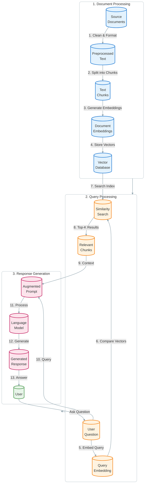

```mermaid
%%{init: {
  'theme': 'base',
  'themeVariables': {
    'primaryColor': '#E3F2FD',
    'primaryBorderColor': '#1976D2',
    'secondaryColor': '#FFF3E0',
    'tertiaryColor': '#FCE4EC',
    'fontFamily': '-apple-system, BlinkMacSystemFont, "Segoe UI", Roboto, sans-serif',
    'fontSize': '14px',
    'lineColor': '#90A4AE',
    'textColor': '#263238',
    'mainBkg': '#FFFFFF',
    'nodeBorder': '#455A64',
    'clusterBkg': '#FAFAFA',
    'clusterBorder': '#B0BEC5'
  }
}}%%

graph TB
    %% Document Processing Section
    subgraph DP["1. Document Processing"]
        direction TB
        expert[("Source<br/>Documents")]:::expertText
        prepped[("Preprocessed<br/>Text")]:::expertText
        chunked[("Text<br/>Chunks")]:::expertText
        embedded[("Document<br/>Embeddings")]:::expertText
        dict[("Vector<br/>Database")]:::expertText

        expert --> |"1. Clean & Format"| prepped
        prepped --> |"2. Split into Chunks"| chunked
        chunked --> |"3. Generate Embeddings"| embedded
        embedded --> |"4. Store Vectors"| dict
    end

    %% Query Processing Section
    subgraph QP["2. Query Processing"]
        direction TB
        query[("User<br/>Question")]:::userQuery
        embeddedQuery[("Query<br/>Embedding")]:::userQuery
        resultQuery[("Similarity<br/>Search")]:::userQuery
        topK[("Relevant<br/>Chunks")]:::userQuery

        query --> |"5. Embed Query"| embeddedQuery
        embeddedQuery --> |"6. Compare Vectors"| resultQuery
        dict --> |"7. Search Index"| resultQuery
        resultQuery --> |"8. Top-K Results"| topK
    end

    %% Response Generation Section
    subgraph RG["3. Response Generation"]
        direction TB
        prompt[("Augmented<br/>Prompt")]:::llm
        llmBox[("Language<br/>Model")]:::llm
        response[("Generated<br/>Response")]:::llm
        user[("User")]:::user

        prompt --> |"11. Process"| llmBox
        llmBox --> |"12. Generate"| response
        response --> |"13. Answer"| user
    end

    %% Inter-section connections
    DP --> QP
    QP --> RG
    user --> |"Ask Question"| query
    topK --> |"9. Context"| prompt
    query --> |"10. Query"| prompt

    %% Node styling with circular shapes and soft colors
    classDef expertText fill:#E3F2FD,stroke:#1976D2,stroke-width:2px,rx:30
    classDef userQuery fill:#FFF3E0,stroke:#F57C00,stroke-width:2px,rx:30
    classDef llm fill:#FCE4EC,stroke:#C2185B,stroke-width:2px,rx:30
    classDef user fill:#E8F5E9,stroke:#388E3C,stroke-width:2px,rx:30
    
    %% Section styling with elegant borders
    classDef section fill:none,stroke:#B0BEC5,stroke-width:1px,rx:8
    class DP,QP,RG section

    %% Link styling with softer lines
    linkStyle default stroke:#90A4AE,stroke-width:1.5px
``` 